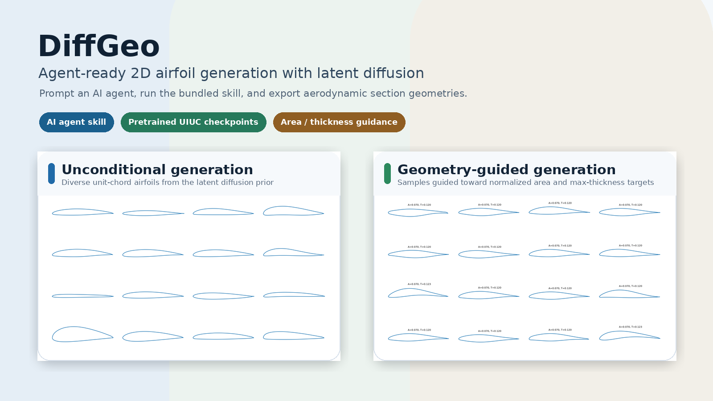
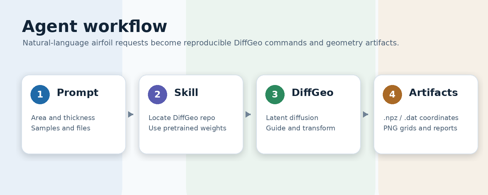

<div align="center">

# DiffGeo

**面向 AI Agent 的 2D 翼型 / Aerofoil 潜空间扩散生成工具**

DiffGeo 支持用 AI、LLM 或 Agent 生成翼型、机翼截面、叶片截面和受面积 / 厚度约束的气动几何；同时保留完整的 Python 开源代码、预训练 UIUC checkpoint、训练脚本和复现实验流程。

[](https://www.python.org/)
[](https://pytorch.org/)
[](skills/diffgeo-airfoil-generation/SKILL.md)
[](pretrained/uiuc_airfoil_full_v1)
[](LICENSE)

[English](./README.md) | [简体中文](./README.zh-CN.md)



</div>

## 为什么使用 DiffGeo

DiffGeo 是论文 **Aerodynamic Shape Design Space Exploration with Deep Latent Diffusion Model**（AIAA Journal, 2026）的 2D 翼型开源版本。它是会议论文 **DiffAirfoil: An Efficient Novel Airfoil Sampler Based on Latent Space Diffusion Model for Aerodynamic Shape Optimization** (AIAA Aviation Forum, 2024) 的期刊扩展版本。它不是只给人手动运行脚本的传统代码仓库，而是同时提供了面向 Agent 的 skill，让智能体可以把自然语言需求转换为可复现的翼型生成命令。

本仓库提供：

- 面向 AI Agent / LLM workflow 的通用翼型生成 skill；
- 可直接使用的 full-UIUC 预训练 checkpoint；
- 用于无条件生成、条件生成、坐标变换、训练和复现的 Python CLI；
- 针对归一化截面积和最大厚度的简单几何引导；
- 面向下游气动分析流程的 `.npz`、`.dat`、`.png` 和文本报告输出。

DiffGeo 不让 LLM 直接凭空编造坐标。Agent 会读取 skill 指令，调用可复现的 DiffGeo 工具链，再由训练好的 latent diffusion 模型生成翼型几何。

## Agent Skill 快速上手

Skill 文件位于：

```text
skills/diffgeo-airfoil-generation/SKILL.md
```

当你希望“用 AI 生成翼型”、“用 LLM 生成翼型”或“让 Agent 自动生成 airfoil/aerofoil 几何”时，可以让 Agent 使用这个 skill。它适用于 2D 翼型、机翼截面、叶片截面、弦长缩放、坐标平移，以及简单的面积 / 最大厚度约束生成。

可以给 Agent 这样的指令：

```text
Use the DiffGeo airfoil-generation skill from this repository.
Generate 16 unit-chord airfoils with target area 0.07 and max thickness 0.12,
then export .dat files for downstream aerodynamic analysis.
```

Agent 实际执行路径如下：



如果你的 Agent runtime 支持 repo-local skills 或可复用工具说明，可以注册或指向 `skills/diffgeo-airfoil-generation/`。对于普通代码助手，也可以把 `SKILL.md` 内容放入上下文，并设置 `DIFFGEO_ROOT` 指向本仓库。

## Python 快速上手

从 GitHub 克隆并安装：

```bash
git clone https://github.com/kfxw/DiffGeo.git
cd DiffGeo
python -m venv .venv
source .venv/bin/activate
python -m pip install --upgrade pip
python -m pip install -e ".[dev]"
```

解压内置 UIUC 翼型坐标：

```bash
tar -xzf data/uiuc_airfoils.tar.gz -C data
```

生成具有归一化几何目标的翼型：

```bash
diffgeo-sample-conditional \
  --config configs/full_uiuc.yaml \
  --pretrained-dir pretrained/uiuc_airfoil_full_v1 \
  --target-area 0.07 \
  --target-max-thickness 0.12 \
  --num-samples 16 \
  --output-dir outputs/pretrained_conditional
```

生成无条件翼型样本：

```bash
diffgeo-sample-unconditional \
  --config configs/full_uiuc.yaml \
  --pretrained-dir pretrained/uiuc_airfoil_full_v1 \
  --num-samples 16 \
  --output-dir outputs/pretrained_unconditional
```

对生成坐标做弦长缩放和平移：

```bash
diffgeo-transform-airfoils \
  --input outputs/pretrained_conditional/conditional_samples.npz \
  --chord-scale 1.5 \
  --shift-x 0.25 \
  --shift-y -0.05 \
  --output-dir outputs/pretrained_transformed
```

面积和最大厚度目标使用归一化单位弦长坐标系。`chord-scale` 先对 x/y 坐标做统一缩放，然后 `shift-x` 和 `shift-y` 再做平移。

## 安装说明

部分精简 Debian/Ubuntu 容器没有包含 `ensurepip`，因此运行 `python -m venv` 时可能需要先安装 `python3.10-venv`。如果你不能修改镜像，可以把依赖安装到项目本地目录：

```bash
mkdir -p .deps .cache .pip-cache .tmp
export PIP_CACHE_DIR=$PWD/.pip-cache
export XDG_CACHE_HOME=$PWD/.cache
export TMPDIR=$PWD/.tmp
python -m pip install --target .deps -r requirements.txt
export PYTHONPATH=$PWD/src:$PWD/.deps
```

如果要重新训练模型，请安装与宿主机 NVIDIA driver 兼容的 PyTorch GPU wheel。

## 仓库结构

```text
DiffGeo/
├── .github/assets/                 # README 展示素材
├── configs/                        # full UIUC 实验配置
├── data/
│   ├── uiuc_airfoils.tar.gz         # UIUC 坐标压缩包
│   └── splits/                      # train_full_UIUC 和 test_UIUC split
├── pretrained/uiuc_airfoil_full_v1/ # 发布版 full-UIUC checkpoint bundle
├── scripts/                         # CLI wrapper
├── skills/diffgeo-airfoil-generation/
├── src/diffgeo/                     # Python package 实现
└── tests/                           # 单元测试和数据加载测试
```

## 数据

UIUC 翼型坐标以压缩包形式发布：

```text
data/uiuc_airfoils.tar.gz
```

运行测试、训练或数据相关命令前需要解压：

```bash
tar -xzf data/uiuc_airfoils.tar.gz -C data
```

解压后的路径应为：

```text
data/uiuc_airfoils/dat/
```

当前 release 保留两个 split：

```text
data/splits/train_full_UIUC.txt
data/splits/test_UIUC.txt
```

内置 UIUC 坐标用于复现 2D 翼型实验。重新分发派生包时，请遵守上游 UIUC airfoil database 的使用条款。

## 预训练模型

仓库包含 full-UIUC 预训练 checkpoint：

```text
pretrained/uiuc_airfoil_full_v1
```

生成命令通常会输出：

```text
*_samples.npz
*_grid.png
*_report.txt
*_dat/*.dat
```

坐标变换命令通常会输出：

```text
transformed_airfoils.npz
transformed_grid.png
transformed_transform_report.txt
transformed_dat/*.dat
```

## Full UIUC 复现

运行完整训练流程：

```bash
diffgeo-train-autodecoder --config configs/full_uiuc.yaml
diffgeo-encode-latents --config configs/full_uiuc.yaml
diffgeo-train-diffusion --config configs/full_uiuc.yaml
diffgeo-sample-unconditional --config configs/full_uiuc.yaml --num-samples 64
diffgeo-sample-conditional \
  --config configs/full_uiuc.yaml \
  --target-area 0.07 \
  --target-max-thickness 0.12 \
  --num-samples 64
```

完整运行后应产生：

```text
outputs/full_uiuc/checkpoints/autodecoder.pt
outputs/full_uiuc/latents/uiuc_latents.npz
outputs/full_uiuc/checkpoints/diffusion.pt
outputs/full_uiuc/samples/unconditional_grid.png
outputs/full_uiuc/samples/conditional_grid.png
outputs/full_uiuc/samples/conditional_unguided_baseline_grid.png
outputs/full_uiuc/samples/conditional_report.txt
```

`conditional_report.txt` 会同时报告 guided 和 unguided baseline 的误差。成功运行时，guided mean absolute error 应低于 unguided baseline，且在报告容差下不出现 surface-order violations。

## 测试

解压 `data/uiuc_airfoils.tar.gz` 后运行：

```bash
pytest -q
```

## 引用

```bibtex
@article{wei2026diffgeo,
  title={Aerodynamic Shape Design Space Exploration with Deep Latent Diffusion Model},
  author={Wei, Zhen and Dufour, Edouard and Pelletier, Colin and Bauerheim, Michael and Fua, Pascal},
  journal={AIAA Journal},
  year={2026}
}
```

如果你在翼型相关应用、研究或开发中使用本工作，请同时引用 DiffGeo 的会议版本论文 **DiffAirfoil**：

```bibtex
@inproceedings{wei2024diffairfoil,
  title={DiffAirfoil: An Efficient Novel Airfoil Sampler Based on Latent Space Diffusion Model for Aerodynamic Shape Optimization},
  author={Wei, Zhen and Dufour, Edouard R. and Pelletier, Colin and Fua, Pascal and Bauerheim, Michaël},
  booktitle={AIAA AVIATION FORUM AND ASCEND 2024},
  year={2024},
  doi={10.2514/6.2024-3755}
}
```

## 许可证

代码基于 MIT license 发布。
